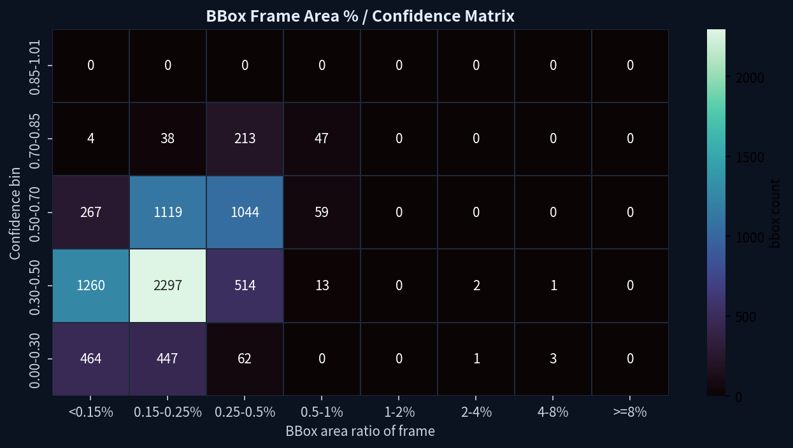
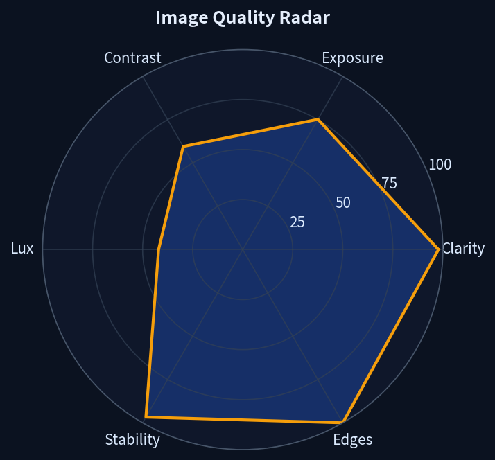
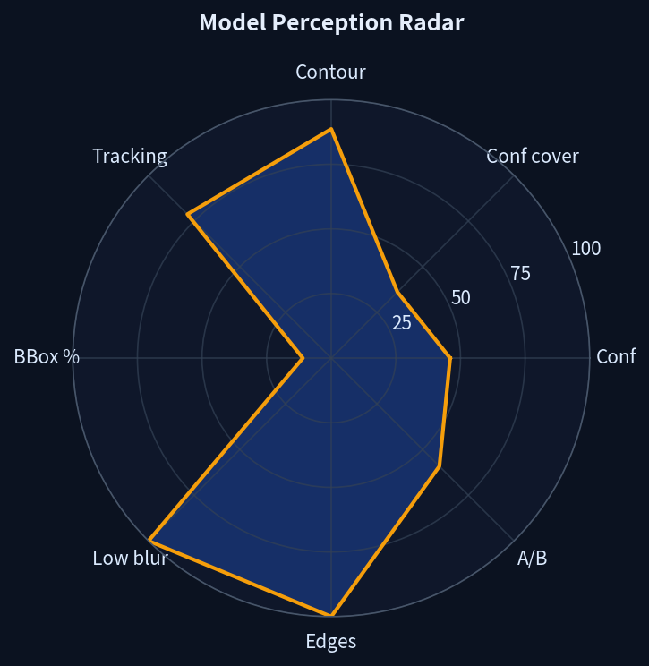
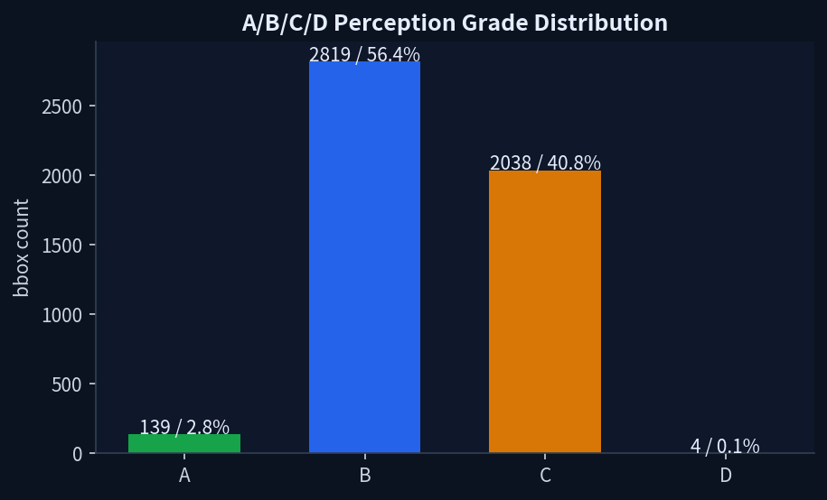
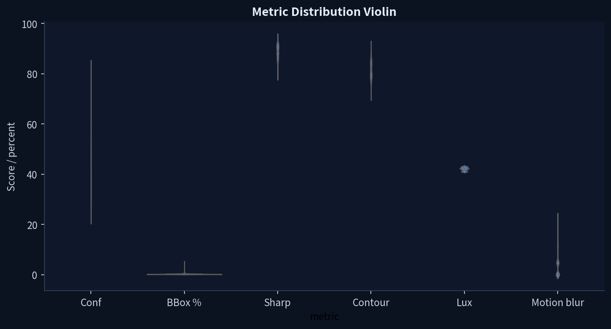
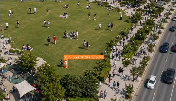

# YOLO Inference Assessment WebUI

<p align="center">
  
</p>

YOLO Inference Assessment WebUI is a Dockerized tool for quantifying how image quality affects YOLO/TFLite object-detection performance on edge devices.

Instead of only asking whether a model detects an object, this project helps define **what kind of video/image quality is good enough for the model to perceive, detect, and track people reliably**.

## Purpose

Edge AI deployments are often limited by camera conditions: target size, blur, exposure, contrast, lighting, and tracking instability. This dashboard turns those visual conditions into measurable indicators that can be used for model assessment, customer reports, and product specifications.

It is built for questions like:

- How small can a person bbox be before confidence drops?
- What confidence range is stable under the current image quality?
- How much blur or low contrast can the model tolerate?
- How stable are tracking IDs in continuous video?
- What image-quality standard should be written into an edge-device product spec?

## Report Preview

The following charts are extracted from a COCO model-quality report generated by this project.

**BBox Confidence Matrix**



**Image Quality Radar**



**Model Perception Radar**



**A/B/C/D Grade Distribution**



**Metric Distribution**



**Representative BBox Sample**



## Quick Start

```bash
git clone https://github.com/a0665x/YOLO_Assessnent.git
cd YOLO_Assessnent
./run.sh start
```

Open:

```text
http://127.0.0.1:7860
```

Useful commands:

```bash
./run.sh --help
./run.sh restart
./run.sh rebuild
./run.sh down_up
./run.sh logs
```

Input folders:

```text
models/   TFLite models
videos/   .mp4, .mkv, .webm videos
images/   image batch inputs
```

Reports are exported as self-contained HTML/JSON files and downloaded through the browser.

## Key Features

- Select and load YOLO `.tflite` models.
- Analyze videos, webcam streams, or image batches.
- Stream live inference overlays with bbox, confidence, tracking ID, and quality values.
- Quantify bbox frame-area percentage instead of raw pixel area.
- Inspect bbox size bins interactively with real sampled frames.
- Measure bbox sharpness, contour clarity, edge density, brightness, contrast, and blur.
- Estimate whole-frame quality: clarity, exposure, contrast, motion stability, and lux proxy.
- Analyze tracking stability for video/webcam sources.
- Generate A/B/C/D perception grades for model-operating quality.
- Export localized reports in Chinese, English, Japanese, and Korean.

## Dashboard Concepts

### BBox Confidence Matrix

The matrix compares detection confidence against bbox size as a percentage of the full frame. The x-axis uses practical size classes such as `XXS`, `XS`, `S`, `M`, `L`, `XL`, and `XXL`.

Use it to see which target-size range produces reliable detections.

### Radar Charts

The image-quality radar summarizes the input frame condition: clarity, exposure, contrast, lux proxy, motion stability, and edge structure.

The model-perception radar summarizes model-facing indicators: confidence coverage, bbox contour quality, tracking stability, bbox size coverage, low-blur coverage, edge coverage, and A/B grade coverage.

### Grade And Metric Distribution

The A/B/C/D chart gives a product-facing perception grade distribution.

The metric distribution chart shows mean, standard deviation, and percentile spread for key image/model indicators.

### Sample BBox Analysis

Representative samples connect the numeric indicators back to real frames and detected boxes. They are useful when validating whether a low/high score matches the visible bbox quality.

## A/B/C/D Grade

For video and webcam sources:

```text
score = 40% confidence
      + 30% bbox sharpness
      + 20% tracking stability
      + 10% bbox size score
```

For image batches:

```text
score = 45% confidence
      + 40% bbox sharpness
      + 15% bbox size score
```

Thresholds:

```text
A >= 75
B >= 60
C >= 45
D < 45
```

This grade is an operational perception indicator. It complements labeled-dataset metrics such as mAP, precision, and recall, but does not replace them.

## Docker Notes

Default URL:

```text
http://127.0.0.1:7860
```

Change host port:

```bash
HOST_PORT=8080 ./run.sh start
```

Change report download directory:

```bash
DOWNLOAD_DIR=/path/to/downloads ./run.sh start
```

## Project Structure

```text
app.py                  Flask backend, inference loop, metrics, reports
templates/index.html    WebUI shell
static/app.js           UI logic, charts, interactions, localization
static/styles.css       Dashboard styling
models/                 TFLite models
videos/                 Video inputs
images/                 Image batch inputs
reports/                Generated reports
docs/assets/            README chart assets
spec/                   Technical project notes
run.sh                  Docker operation helper
```

## Limitations

- The default target class is `person`.
- Tracking quality is only meaningful for continuous video/webcam sources.
- `lux proxy` is an image-derived relative indicator, not a calibrated physical lux measurement.
- The dashboard measures model perception under image conditions; it is not a labeled dataset evaluation suite by itself.

## License

MIT License. See [LICENSE](./LICENSE).
